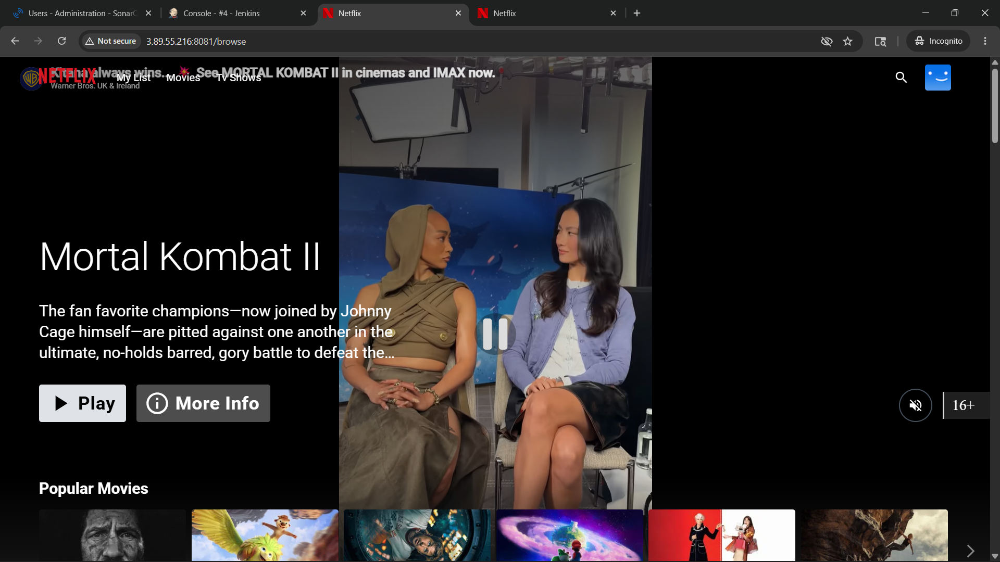
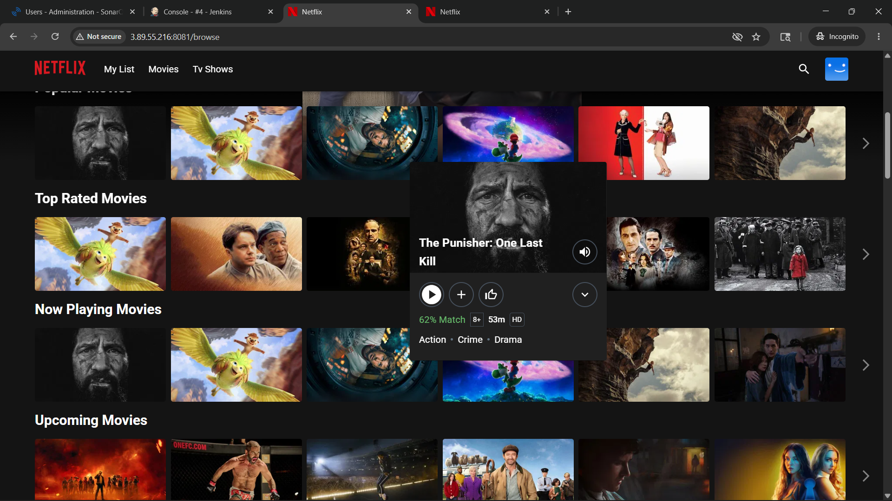
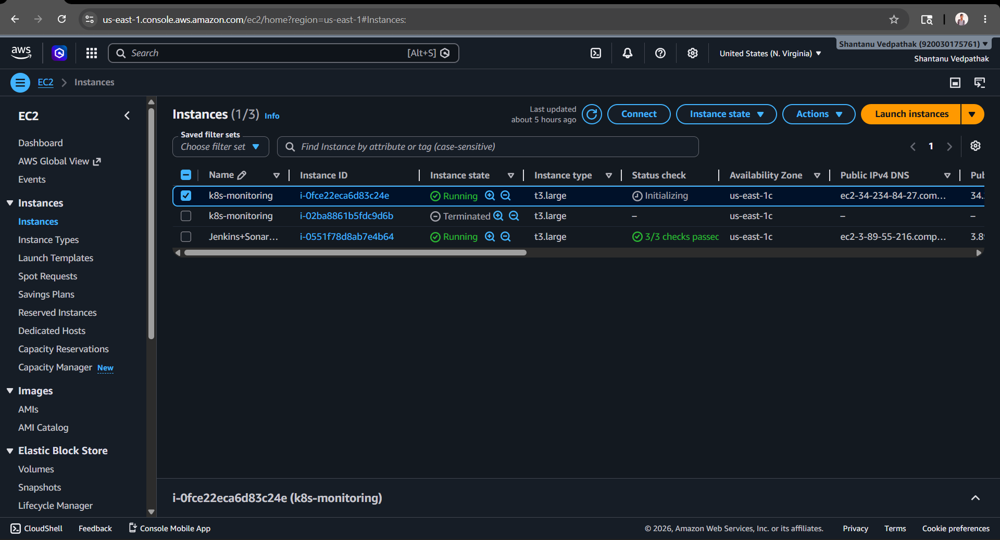
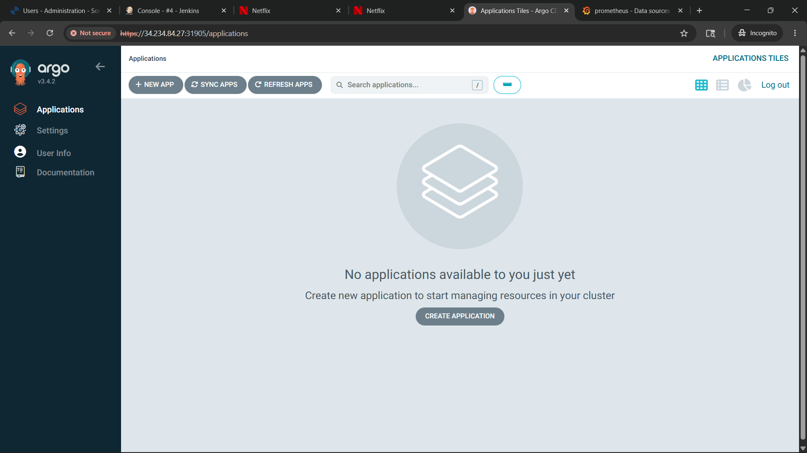
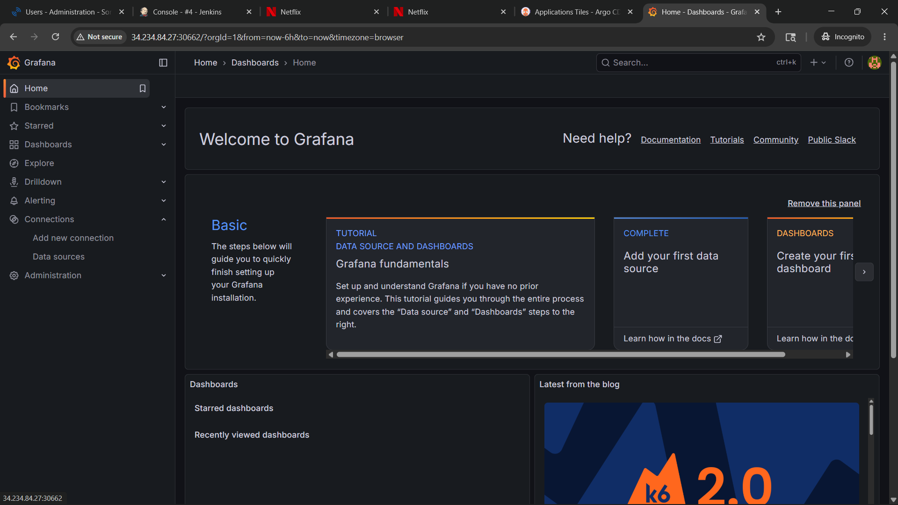
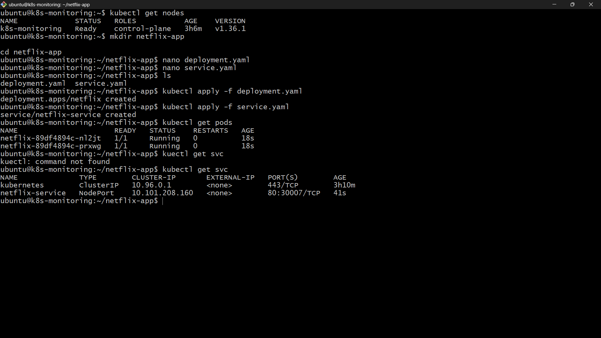

# Enterprise DevSecOps CI/CD Pipeline on AWS with Kubernetes, GitOps & Monitoring





## Project Overview

This project demonstrates a complete end-to-end DevSecOps CI/CD pipeline deployed on AWS using self-managed Kubernetes. The application used in this project is a Netflix clone frontend application integrated with TMDB API.

The primary objective of this project was to implement:

* Continuous Integration & Continuous Deployment (CI/CD)
* DevSecOps security scanning
* Containerization using Docker
* Kubernetes orchestration
* GitOps using ArgoCD
* Monitoring using Prometheus & Grafana
* Deployment on AWS EC2 infrastructure

---

# Architecture Diagram

```text
                    +----------------------+
                    |      Developer       |
                    +----------+-----------+
                               |
                               v
                    +----------------------+
                    |    GitHub Repository |
                    +----------+-----------+
                               |
                               v
                    +----------------------+
                    |       Jenkins        |
                    |   CI/CD Pipeline     |
                    +----------+-----------+
                               |
          ---------------------------------------------
          |                   |                      |
          v                   v                      v
+----------------+   +----------------+   +----------------+
|  SonarQube     |   |     Trivy      |   | Docker Build   |
| Code Analysis  |   | Security Scan  |   | & Push Image   |
+----------------+   +----------------+   +----------------+
                                                    |
                                                    v
                                      +--------------------------+
                                      |      DockerHub           |
                                      |   Container Registry     |
                                      +------------+-------------+
                                                   |
                                                   v
                                      +--------------------------+
                                      |    Kubernetes Cluster    |
                                      |      Self-Managed        |
                                      +------------+-------------+
                                                   |
                     --------------------------------------------------------
                     |                          |                           |
                     v                          v                           v
             +---------------+        +----------------+         +----------------+
             | Netflix App   |        |    ArgoCD      |         | Prometheus     |
             | Deployment    |        |    GitOps      |         | Monitoring     |
             +---------------+        +----------------+         +----------------+
                                                                          |
                                                                          v
                                                                +----------------+
                                                                |    Grafana     |
                                                                | Dashboards     |
                                                                +----------------+
```

---

# AWS Infrastructure Used

| Resource       | Purpose                                |
| -------------- | -------------------------------------- |
| EC2 Instance 1 | Jenkins, SonarQube, Docker, Trivy      |
| EC2 Instance 2 | Kubernetes Cluster, ArgoCD, Monitoring |
| Ubuntu 22.04   | Operating System                       |
| DockerHub      | Container Registry                     |
| GitHub         | Source Code Repository                 |

---

# Technology Stack

| Category           | Tool       |
| ------------------ | ---------- |
| CI/CD              | Jenkins    |
| Security Scanning  | Trivy      |
| Code Quality       | SonarQube  |
| Containerization   | Docker     |
| Container Registry | DockerHub  |
| Orchestration      | Kubernetes |
| GitOps             | ArgoCD     |
| Monitoring         | Prometheus |
| Visualization      | Grafana    |
| Cloud Platform     | AWS EC2    |
| Source Control     | GitHub     |

---

# Project Workflow

```text
Developer Pushes Code
        ↓
GitHub Repository
        ↓
Jenkins Pipeline Triggered
        ↓
Trivy Security Scan
        ↓
Docker Image Build
        ↓
DockerHub Image Push
        ↓
Kubernetes Deployment
        ↓
ArgoCD GitOps Synchronization
        ↓
Prometheus Monitoring
        ↓
Grafana Dashboard Visualization
```

---

# Phase 1 — AWS EC2 Infrastructure Setup

## EC2-1 Configuration (DevSecOps Server)

Installed:

* Jenkins
* Docker
* SonarQube
* Trivy
* kubectl

Instance Type:

* t3.large

OS:

* Ubuntu 22.04

---

## EC2-2 Configuration (Kubernetes Server)

Installed:

* Kubernetes
* containerd
* ArgoCD
* Prometheus
* Grafana

Instance Type:

* t3.large

OS:

* Ubuntu 22.04

---

# Phase 2 — Jenkins Installation

## Install Java

```bash
sudo apt update && sudo apt upgrade -y
sudo apt install openjdk-17-jdk -y
```

---

## Install Jenkins

```bash
curl -fsSL https://pkg.jenkins.io/debian-stable/jenkins.io-2023.key | sudo tee \
/usr/share/keyrings/jenkins-keyring.asc > /dev/null

echo deb [signed-by=/usr/share/keyrings/jenkins-keyring.asc] \
https://pkg.jenkins.io/debian-stable binary/ | sudo tee \
/etc/apt/sources.list.d/jenkins.list > /dev/null

sudo apt update
sudo apt install jenkins -y
```

---

## Start Jenkins

```bash
sudo systemctl enable jenkins
sudo systemctl start jenkins
```

---

# Phase 3 — Docker Installation

```bash
sudo apt install docker.io -y
sudo usermod -aG docker ubuntu
sudo usermod -aG docker jenkins
sudo systemctl enable docker
sudo systemctl start docker
```

---

# Phase 4 — Trivy Installation

```bash
sudo apt install wget apt-transport-https gnupg lsb-release -y

wget -qO - https://aquasecurity.github.io/trivy-repo/deb/public.key | \
sudo gpg --dearmor -o /usr/share/keyrings/trivy.gpg

echo "deb [signed-by=/usr/share/keyrings/trivy.gpg] \
https://aquasecurity.github.io/trivy-repo/deb $(lsb_release -sc) main" | \
sudo tee /etc/apt/sources.list.d/trivy.list

sudo apt update
sudo apt install trivy -y
```

---

# Phase 5 — SonarQube Setup

```bash
docker run -d --name sonarqube \
-p 9000:9000 \
sonarqube:lts-community
```

Access:

```text
http://EC2-1-PUBLIC-IP:9000
```

Default Credentials:

```text
Username: admin
Password: admin
```

---

# Phase 6 — Kubernetes Cluster Setup

## Disable Swap

```bash
sudo swapoff -a
```

---

## Install containerd

```bash
sudo apt install containerd -y
```

---

## Install Kubernetes Components

```bash
curl -fsSL https://pkgs.k8s.io/core:/stable:/v1.30/deb/Release.key | \
sudo gpg --dearmor -o /etc/apt/keyrings/kubernetes-apt-keyring.gpg

echo 'deb [signed-by=/etc/apt/keyrings/kubernetes-apt-keyring.gpg] \
https://pkgs.k8s.io/core:/stable:/v1.30/deb/ /' | \
sudo tee /etc/apt/sources.list.d/kubernetes.list

sudo apt update
sudo apt install kubelet kubeadm kubectl -y
```

---

## Initialize Cluster

```bash
sudo kubeadm init --pod-network-cidr=192.168.0.0/16
```

---

## Configure kubectl

```bash
mkdir -p $HOME/.kube
sudo cp -i /etc/kubernetes/admin.conf $HOME/.kube/config
sudo chown $(id -u):$(id -g) $HOME/.kube/config
```

---

## Install Calico Network Plugin

```bash
kubectl apply -f \
https://raw.githubusercontent.com/projectcalico/calico/v3.28.0/manifests/calico.yaml
```

---

## Remove Master Node Taint

```bash
kubectl taint nodes --all node-role.kubernetes.io/control-plane-
```

---

# Phase 7 — Application Dockerization

## Dockerfile

Used multi-stage Docker build:

* Node.js build stage
* Nginx production stage

TMDB API key was injected during build using build arguments.

---

# Phase 8 — Jenkins CI/CD Pipeline

## Pipeline Stages

1. Clean Workspace
2. Clone Repository
3. Trivy Filesystem Scan
4. Docker Image Build
5. Docker Image Scan
6. DockerHub Push
7. Local Container Deployment

---

## Jenkins Credentials Used

| Credential   | Type                |
| ------------ | ------------------- |
| github-creds | Username + Password |
| dockerhub    | Username + Password |
| tmdb-api-key | Secret Text         |

---

# Phase 9 — Kubernetes Deployment

## deployment.yaml

Used to create:

* Pods
* Replicas
* Container deployment

---

## service.yaml

Used:

```yaml
NodePort
```

for external access.

---

## Deploy Application

```bash
kubectl apply -f deployment.yaml
kubectl apply -f service.yaml
```

---

# Phase 10 — ArgoCD Setup

## Install ArgoCD

```bash
kubectl create namespace argocd
```

```bash
kubectl apply -n argocd -f \
https://raw.githubusercontent.com/argoproj/argo-cd/stable/manifests/install.yaml
```

---

## Expose ArgoCD UI

```bash
kubectl patch svc argocd-server -n argocd \
-p '{"spec": {"type": "NodePort"}}'
```

---

# Phase 11 — Monitoring Setup

## Install Helm

```bash
curl https://raw.githubusercontent.com/helm/helm/main/scripts/get-helm-3 | bash
```

---

## Add Helm Repositories

```bash
helm repo add prometheus-community https://prometheus-community.github.io/helm-charts
helm repo add grafana https://grafana.github.io/helm-charts
helm repo update
```

---

## Install Lightweight Prometheus

```bash
helm install prometheus prometheus-community/prometheus \
--set server.persistentVolume.enabled=false \
--set alertmanager.persistentVolume.enabled=false \
--set alertmanager.enabled=false \
--set pushgateway.enabled=false
```

---

## Install Grafana

```bash
helm install grafana grafana/grafana
```

---

# Grafana Dashboard Configuration

## Prometheus Datasource

Used:

```text
http://prometheus-server
```

---

## Dashboard IDs Used

| Dashboard             | ID    |
| --------------------- | ----- |
| Node Exporter Full    | 1860  |
| Kubernetes Monitoring | 15757 |
| Pod Monitoring        | 11159 |

---

# Security Implementations

| Security Feature                | Tool                |
| ------------------------------- | ------------------- |
| Filesystem Vulnerability Scan   | Trivy               |
| Docker Image Vulnerability Scan | Trivy               |
| Code Quality Analysis           | SonarQube           |
| Secret Management               | Jenkins Credentials |

---

# Challenges Faced and Solutions

| Challenge                            | Cause                                | Solution                               |
| ------------------------------------ | ------------------------------------ | -------------------------------------- |
| Docker permission denied             | Jenkins user lacked Docker access    | Added Jenkins user to Docker group     |
| DockerHub unauthorized               | Incorrect Docker credentials         | Used DockerHub access token            |
| Blank application content            | Incorrect Vite environment variables | Used import.meta.env with VITE_ prefix |
| Kubernetes image not updating        | Cached container image               | Added imagePullPolicy: Always          |
| Prometheus pod pending               | Persistent Volume issue              | Disabled persistent storage            |
| Grafana datasource connection failed | Incorrect Prometheus URL             | Configured correct service endpoint    |
| Trivy failing pipeline               | Vulnerabilities returned exit code 1 | Added --exit-code 0                    |

---

# Final Outcome

Successfully implemented:

* End-to-end CI/CD pipeline
* DevSecOps security scanning
* Docker containerization
* Kubernetes orchestration
* GitOps using ArgoCD
* Monitoring using Prometheus & Grafana
* AWS cloud deployment

---

# Screenshots
 
   
   
   
   


# Future Improvements

* Implement EKS instead of self-managed Kubernetes
* Add Terraform infrastructure automation
* Integrate Slack notifications
* Implement Falco runtime security
* Add Kubernetes ingress controller
* Configure HTTPS using cert-manager
* Implement centralized logging with Loki

---

# Conclusion

This project provided hands-on experience in building a modern DevSecOps pipeline using AWS, Jenkins, Docker, Kubernetes, ArgoCD, Prometheus and Grafana. It demonstrated practical implementation of CI/CD automation, container orchestration, security scanning, GitOps and monitoring in a cloud-native environment.

The project significantly improved understanding of DevOps and DevSecOps practices while simulating a production-style deployment workflow.


# Auther

**Shantanu Vedpathak**
linkedin = www.linkedin.com/in/shantanu-vedpathak-b949562b5

